<div align="center">


<h1>Container App Patterns</h1>

<p><strong>The Institutional-Grade Platform for Standardized Container App Foundations, Design Governance, and Multi-Platform Modernization Ecosystems.</strong></p>

[]()
[]()
[]()

<br/>

> **"Industrializing container design to automate application foundations."** 
> **Container App Patterns** is an enterprise-grade platform designed to provide a secure, measurable, and highly automated foundation for global containerized operations. It orchestrates the complex lifecycle of cloud-native design—from standardized sidecar integration and microservice decomposition to high-throughput pattern delivery and unified design auditing.

</div>

---

## 🏛️ Executive Summary

Inconsistent container design and fragmented microservice architectures are strategic operational liabilities; lack of a standardized pattern library is a primary barrier to organizational engineering maturity. Organizations fail to scale their cloud-native estates not because of a lack of containers, but because of fragmented design standards, lack of automated pattern validation, and an inability to orchestrate design planes with operational precision.

This platform provides the **Design Intelligence Plane**. It implements a complete **Container-App-Patterns-as-Code Framework**, enabling Cloud Architects and Developers to manage global design foundations as first-class citizens. By automating the identification of architectural bottlenecks through real-time telemetry analysis and orchestrating the provisioning of secure performance-driven design policies, we ensure that every organizational application—from edge microservices to core business workers—is designed by default, audited for history, and strictly aligned with institutional design frameworks.

---

## 📐 Architecture Storytelling: Principal Reference Models

### 1. Principal Architecture: Global Container App Patterns & Design Intelligence Plane
This diagram illustrates the end-to-end flow from design telemetry ingestion and multi-cloud orchestration to pattern enforcement, performance validation, and institutional design auditing.

```mermaid
graph LR
    %% Subgraph Definitions
    subgraph DesignIngress["Pattern & Design Ingress"]
        direction TB
        Sidecar_Patterns["Logging / Security / Proxy Sidecars"]
        Decomposition_Rules["Microservice / BFF / API Rules"]
        Lifecycle_Configs["Init / Startup / Shutdown Hooks"]
    end

    subgraph IntelligenceEngine["Design Intelligence Hub"]
        direction TB
        API["FastAPI Design Gateway"]
        PatternOrchestrator["Global Architecture & Design Hub"]
        Governance_Hub["Compliance & Guardrail Hub"]
        AIOps_Validator["Drift & Design Analysis Hub"]
    end

    subgraph OperationsPlane["Distributed Design Ecosystem"]
        direction TB
        ManagedPatterns["Managed Standardized Design Patterns"]
        ActivePipelines["Managed Automated Design Pipes"]
        ModernizationSinks["Managed Infrastructure Delivery Hubs"]
    end

    subgraph OperationsHub["Institutional Data Hub"]
        direction TB
        Scorecard["Design Maturity Scorecard"]
        Analytics["Design Flow & Adoption Velocity Stats"]
        Audit["Forensic Design Metadata Lake"]
    end

    subgraph DevOps["Container-App-Patterns-as-Code Framework"]
        direction TB
        TF["Terraform Design Modules"]
        DriftBot["Productivity & Config Drift Validator"]
        ChatOps["Measurement Operations Hub"]
    end

    %% Flow Arrows
    DesignIngress -->|1. Submit Metadata| API
    API -->|2. Orchestrate Design| PatternOrchestrator
    PatternOrchestrator -->|3. Apply Privacy Guard| Governance_Hub
    Governance_Hub -->|4. Assess Drift| AIOps_Validator
    
    AIOps_Validator -->|5. Execute Provision| OperationsPlane
    OperationsPlane -->|6. Notify Status| ChatOps
    API -->|7. Visualize Health| Scorecard
    
    Scorecard -->|8. Track Maturity| Analytics
    Scorecard -->|9. Record Performance| Audit
    
    TF -->|10. Provision Backbone| IntelligenceEngine
    DriftBot -->|11. Inject Friction Risk| PatternOrchestrator
    Audit -->|12. Improve Operations| ManagedPatterns

    %% Styling
    classDef ingress fill:#f5f5f5,stroke:#616161,stroke-width:2px;
    classDef intel fill:#e8eaf6,stroke:#1a237e,stroke-width:2px;
    classDef operations fill:#e1f5fe,stroke:#01579b,stroke-width:2px;
    classDef ops fill:#ede7f6,stroke:#311b92,stroke-width:2px;
    classDef devops fill:#e8f5e9,stroke:#1b5e20,stroke-width:2px;

    class DesignIngress ingress;
    class IntelligenceEngine intel;
    class OperationsPlane operations;
    class OperationsHub ops;
    class DevOps devops;
```

### 2. The Pattern Lifecycle Flow
The continuous path of a container design platform from initial integration (design) and aggregation (build) to active analysis (deploy), optimization (scale), and institutional forensic auditing (scorecard).

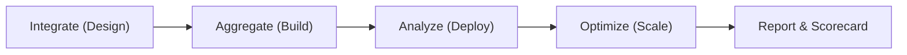

### 3. Distributed Design Topology
Strategically orchestrating standardized design across global cloud regions, diverse container architectures, and multi-platform targets, providing a unified institutional view of global design health and operational readiness.

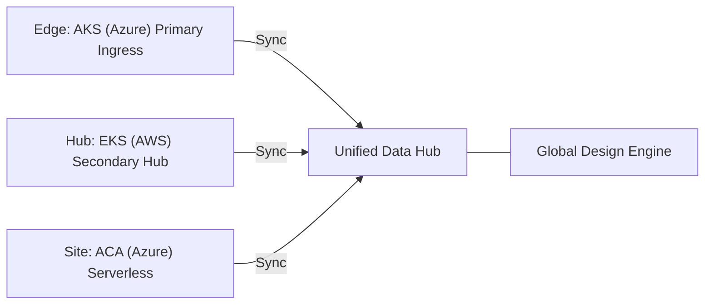

### 4. Design Hub & High-Trust Data Plane Protection Flow
Executing complex logic for securing the bridge between architects and developers, ensuring every organizational identity is verified, design-level privacy is maintained, and every design access is according to institutional standards.

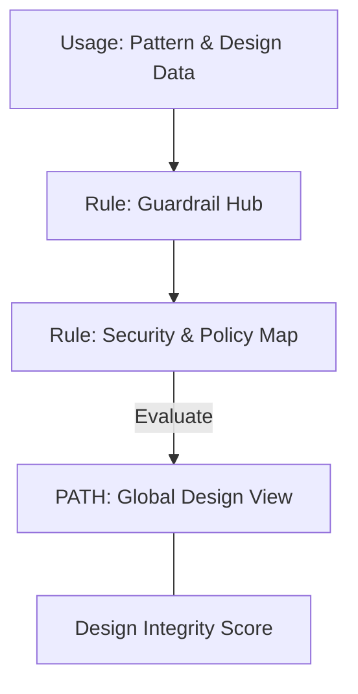

### 5. Multi-Cloud Design Federation & Governance Flow
Automatically managing unified design standards across global regions and diverse cloud tenants, ensuring institutional design residency and privacy boundaries by default.

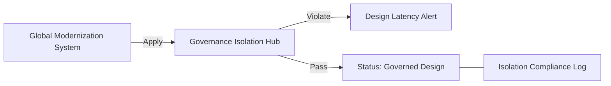

### 6. Encryption & Perimeter Protection Flow (Design Standard)
Managing the lifecycle of a design request, automatically enforcing institutional TLS 1.3 and resource encryption standards as required by security policy, ensuring zero-latency security confidence.

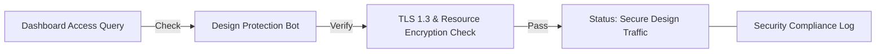

### 7. Institutional Design Maturity Scorecard
Grading organizational performance based on key indicators: Pattern Adoption Index, Microservice Maturity Index, and Design Compliance Scores.

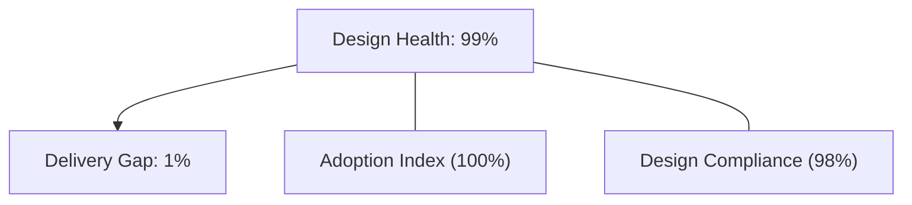

### 8. Identity & RBAC for Design Governance
Managing fine-grained access to design hubs, provisioning workers, and audit logs between Cloud Architects, Platform Leads, and App Developers.

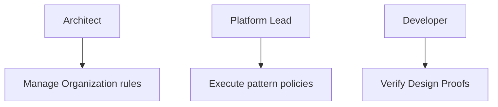

### 9. IaC Deployment: Container-App-Patterns-as-Code Framework
Using modular Terraform to deploy and manage the versioned distribution of the design tracking hubs, pattern protection workers, and forensic metadata lakes.

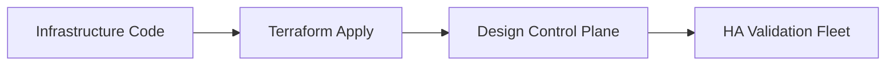

### 10. AIOps Design Drift & Risk Validation Flow
Using advanced analytics to identify sudden surges in pattern fragmentation, unauthorized design changes, suspicious configuration drifts, or unusual delivery pattern changes that could result in institutional risk or technical debt.

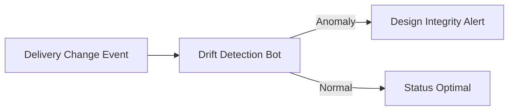

### 11. Metadata Lake for Forensic Design Audit
Storing long-term records of every design integration event (metadata), every pattern executed, and every version history for institutional record-keeping, compliance auditing, and post-provisioning forensics.

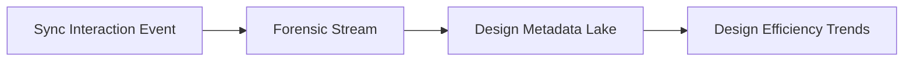

---

## 🏛️ Core Governance Pillars

1.  **Unified Foundation Coordination**: Maximizing resilience by centralizing all design measurement through a single institutional plane.
2.  **Automated Pattern Provisioning**: Eliminating "manual design" scenarios through proactive orchestration and pattern verification.
3.  **Sequential Architecture Intelligence**: Ensuring zero-interruption operations through dependency-aware design-driven data engineering.
4.  **Zero-Trust Identity Protection**: Automatically enforcing identity-based access, data-at-rest encryption, and policy evaluation across all design tiers.
5.  **Autonomous Operations Logic**: Guaranteeing reliability through automated industry-specific effectiveness monitoring runbooks.
6.  **Full Design Auditability**: Immutable recording of every pattern change and design provision for institutional forensics.

---

## 🛠️ Technical Stack & Implementation

### Design Engine & APIs
*   **Framework**: Python 3.11+ / FastAPI.
*   **Performance Engine**: Custom Python-based logic for multi-language design and DORA-style design metrics.
*   **Integrations**: Native connectors for AKS, EKS, ACA, and Docker Hub.
*   **Persistence**: PostgreSQL (Design Ledger) and Redis (Live Pattern State).
*   **Auth Orchestrator**: Federated OIDC/SAML for least-privilege design management access.

### Governance Dashboard (UI)
*   **Framework**: React 18 / Vite.
*   **Theme**: Dark, Slate, Indigo (Modern high-fidelity productivity aesthetic).
*   **Visualization**: D3.js for delivery topologies and Recharts for adoption velocity analytics.

### Infrastructure & DevOps
*   **Runtime**: AWS EKS or Azure Kubernetes Service (AKS) for management plane.
*   **Measurement Hub**: Managed event sourcing for immutable productivity timeline reconstruction.
*   **IaC**: Modular Terraform for deploying the design landing zone and validation fleet.

---

## 🏗️ IaC Mapping (Module Structure)

| Module | Purpose | Real Services |
| :--- | :--- | :--- |
| **`infrastructure/design_hub`** | Central management plane | EKS, PostgreSQL, Redis |
| **`infrastructure/enforcers`** | Distributed pattern provisioners | Azure, AWS, GCP APIs |
| **`infrastructure/design_pipes`** | Data Ingestion Hubs | Webhooks, Lambda |
| **`infrastructure/auditing`** | Forensic modernization sinks | S3, Athena, Quicksight |

---

## 🚀 Deployment Guide

### Local Principal Environment
```bash
# Clone the Container App Patterns repository
git clone https://github.com/devopstrio/container-app-patterns.git
cd container-app-patterns

# Configure environment
cp .env.example .env

# Launch the Design stack
make init

# Trigger a mock design update and automated guardrail validation simulation
make simulate-patterns
```

Access the Management Portal at `http://localhost:3000`.

---

## 📜 License
Distributed under the MIT License. See `LICENSE` for more information.

---
<div align="center">
  <p>© 2026 Devopstrio. All rights reserved.</p>
</div>
