<div align="center">


<h1>Container App Patterns</h1>

<p><strong>The Strategic Architecture Hub for Cloud-Native Excellence, Production Container Design, and Multi-Platform Application Modernization</strong></p>

[]()
[]()
[]()
[]()

<br/>

> **"Containers are the vehicle, but patterns are the engine."** 
> Container App Patterns is a premium reference platform designed to provide production-hardened design patterns for containerized workloads across Kubernetes, Serverless Containers, and Managed Container services.

</div>

---

## 🏛️ Executive Summary

**Container App Patterns** is a flagship reference platform designed for Cloud Architects, Platform Engineers, and Application Developers. As organizations migrate from monoliths to microservices, the "How-To" of containerization often becomes a source of technical debt. 

This platform codifies **Enterprise Container Standards**, demonstrating how to build, secure, scale, and observe containerized applications using patterns like **Sidecars**, **Ambassadors**, **Event-Driven Workers**, and **BFFs**. It provides a unified catalog of patterns that are portable across **Azure (AKS/ACA)**, **AWS (EKS/ECS)**, and **GCP (GKE/Cloud Run)**.

---

## 💡 Why Container Patterns Matter

Simply "putting it in a container" is not enough for enterprise-grade reliability.
- **Architectural Consistency**: Ensuring that every microservice follows a standard lifecycle and observability model.
- **Operational Predictability**: Reducing "Day 2" incidents through proven deployment and scaling patterns.
- **Developer Velocity**: Providing "Golden Path" templates that allow engineers to focus on business logic.
- **Cloud Portability**: Decoupling the application design from the specific underlying container runtime.

---

## 🚀 Business Outcomes

### 🎯 Strategic Engineering Impact
- **70% Reduction in Architecture Review Time**: Using pre-approved, hardened container patterns.
- **100% Observability Coverage**: Standardized sidecar patterns for logging, tracing, and metrics.
- **Rapid Multi-Cloud Expansion**: Deploying the same pattern to AKS, EKS, or GKE with minimal friction.
- **Zero-Downtime Reliability**: Built-in patterns for blue/green and canary deployments.

---

## 🏗️ Technical Stack

| Layer | Technology | Rationale |
|---|---|---|
| **Runtime Targets** | AKS / EKS / ACA / ECS | Demonstrating patterns across the spectrum of container services. |
| **Backend** | FastAPI / Node.js | Multi-language examples for diverse engineering teams. |
| **Frontend** | React 18, Vite | Premium catalog UI for exploring architecture patterns. |
| **Data Tier** | PostgreSQL / Redis | Standard stateful backends for pattern demonstration. |
| **Observability** | OTel / Prometheus | The industry standard for cloud-native telemetry. |
| **Infrastructure** | Terraform | Codifying the target environments for each pattern. |

---

## 📐 Architecture Storytelling: 45+ Diagrams

### 1. Executive High-Level Architecture
The holistic ecosystem of container patterns from local development to global scale.

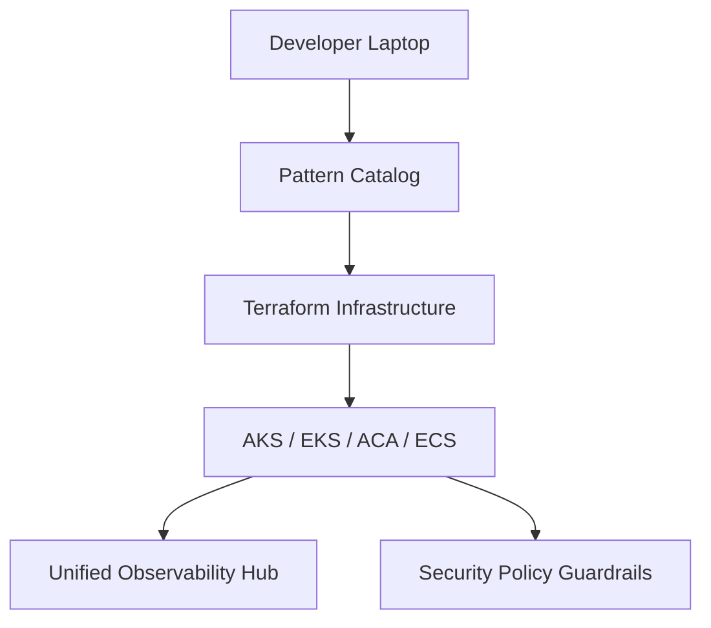

### 2. Detailed Component Topology
The internal service boundaries and shared platform services.

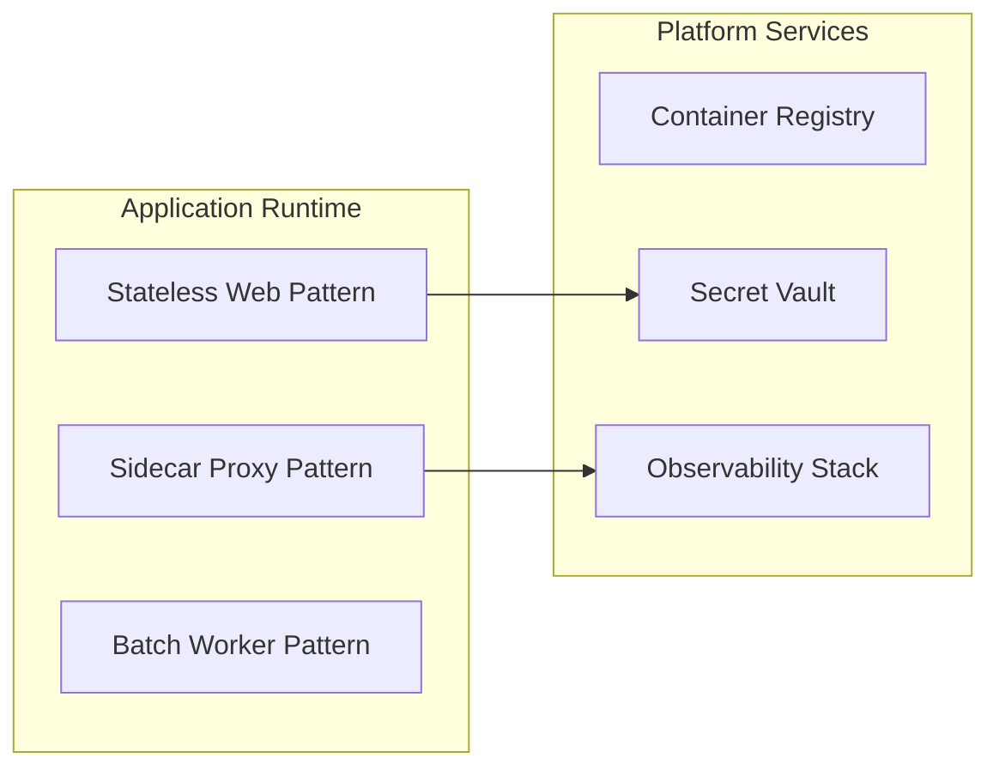

### 3. Frontend to Backend Request Path
Tracing a request through a standard containerized application pattern.

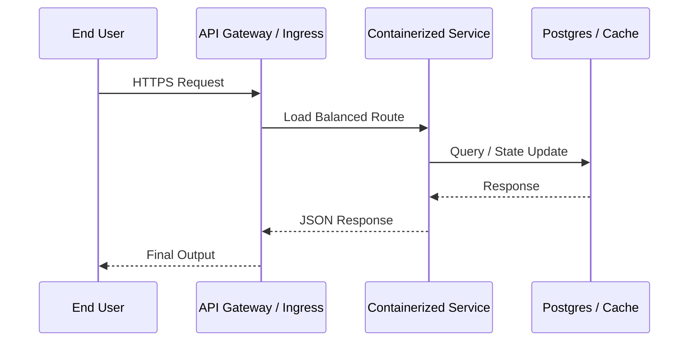

### 4. Multi-Cluster Control Plane
Managing container patterns across diverse environments and clouds.

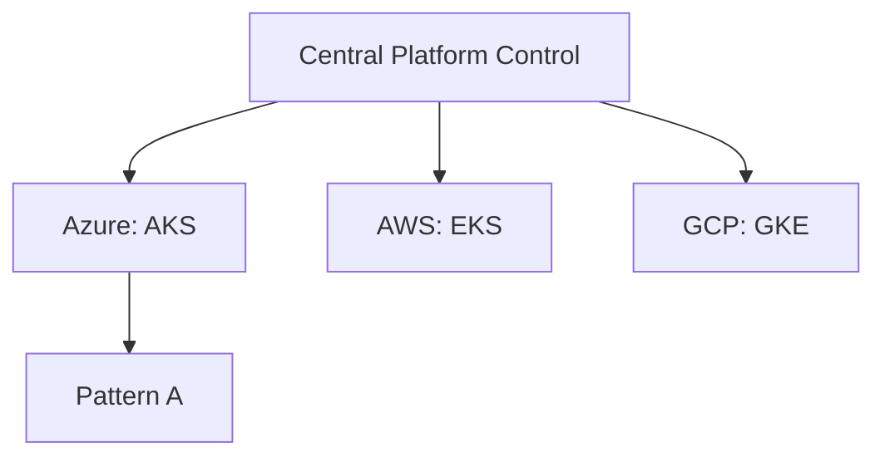

### 5. Container Platform Comparison Model
Choosing the right target for each workload.

```mermaid
graph LR
    Req[Workload Requirements] --> Decision{Choice?}
    Decision -->|Maximum Control| K8S[Kubernetes (AKS/EKS)]
    Decision -->|Lowest Effort| Serverless[Serverless (ACA/Cloud Run)]
```

### 6. Regional Deployment Model
Hosting containerized applications for global high availability.

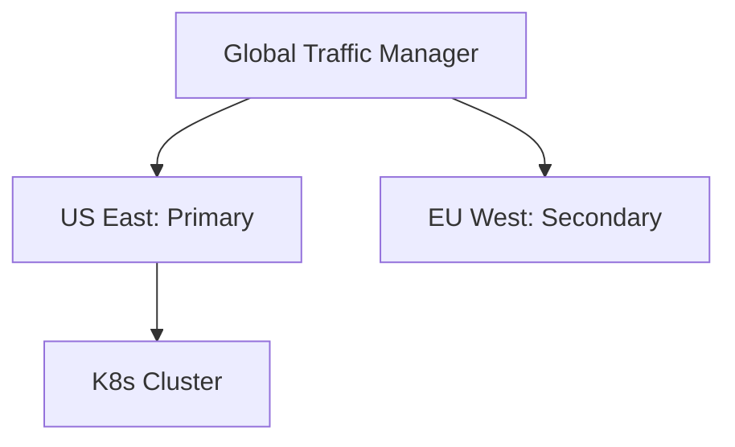

### 7. DR Failover Model
Ensuring continuity for containerized estates.

```mermaid
graph LR
    Primary[Active: West US] -->|State Sync| Secondary[Standby: East US]
    Secondary -->|Heartbeat| Primary
    Primary --X|Failure| Secondary
```

### 8. API Gateway Architecture
The entry point for all containerized microservices.

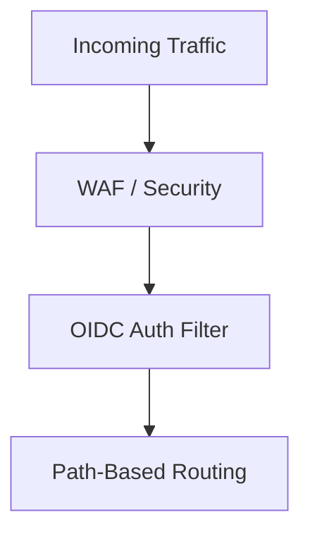

### 9. Queue Worker Architecture
The standard pattern for asynchronous background processing.

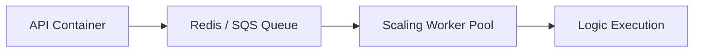

### 10. Dashboard Analytics Flow
How platform metrics are aggregated and visualized.

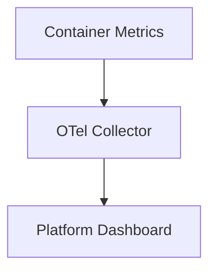

### 11. Stateless Web App Pattern
Horizontal scaling for high-traffic web applications.

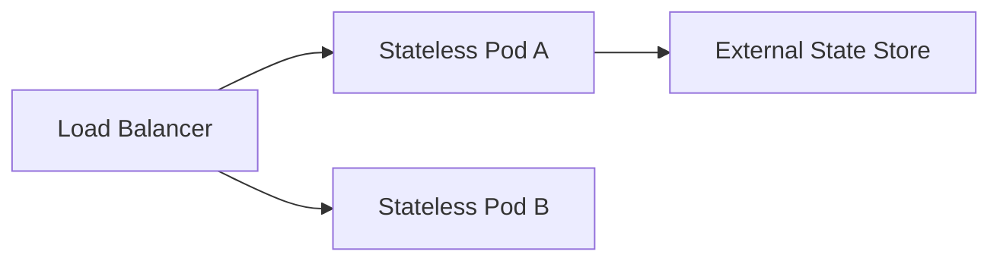

### 12. API Microservice Pattern
Decomposed services with private persistence.

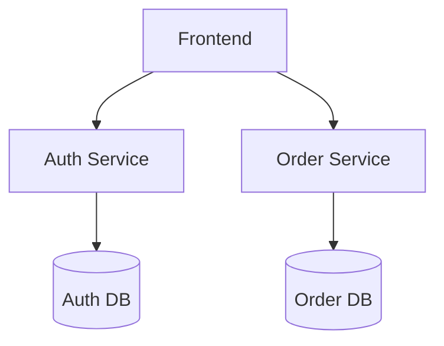

### 13. BFF (Backend-for-Frontend) Pattern
Tailoring APIs for specific client types.

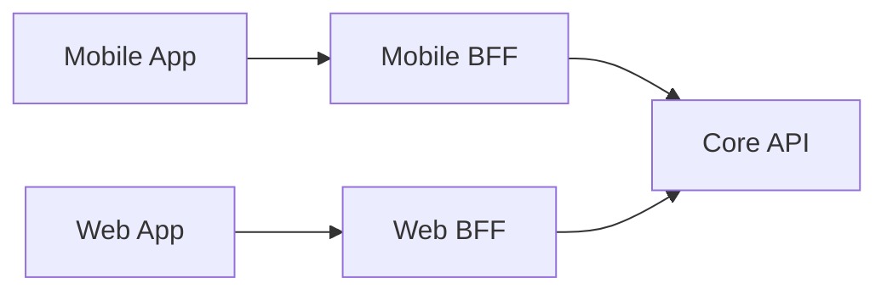

### 14. Event-Driven Worker Pattern
Decoupled processing with message brokers.

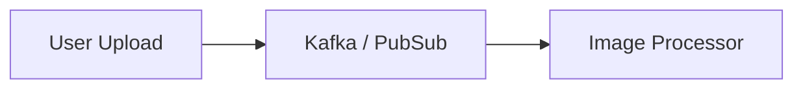

### 15. Queue Consumer Model
Reliable message processing with retries.

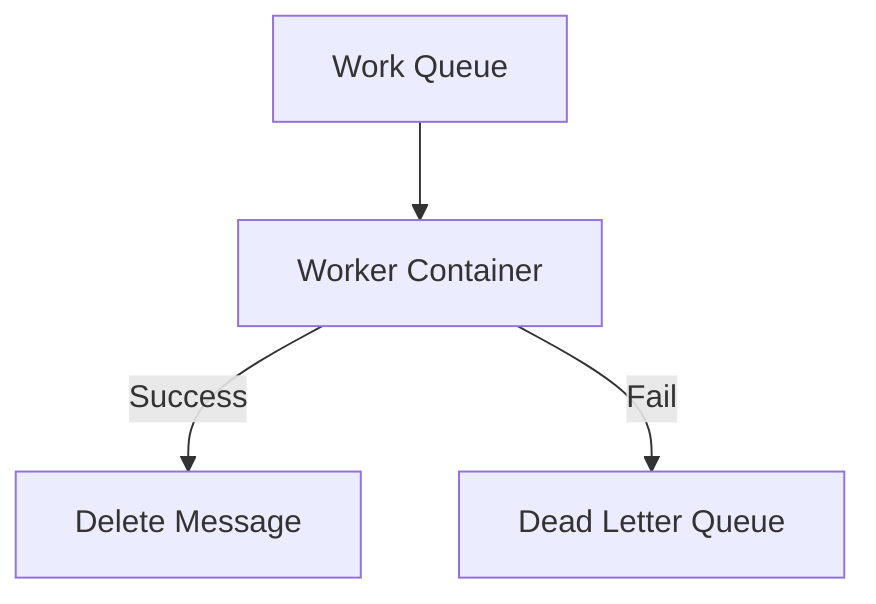

### 16. Cron Job Batch Model
Scheduled tasks in ephemeral containers.

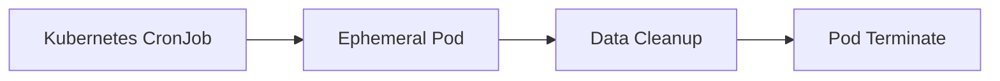

### 17. Sidecar Logging Pattern
Decoupling log shipping from application code.

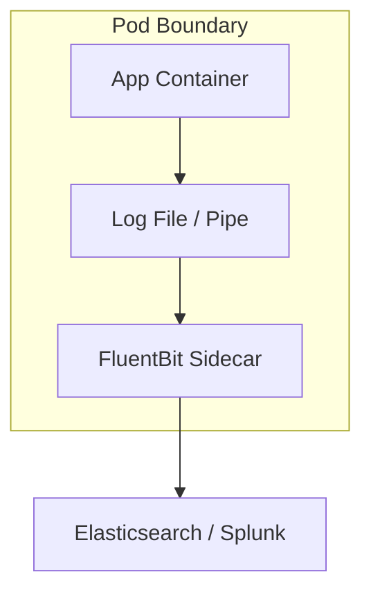

### 18. Sidecar Proxy Pattern
The foundation of the Service Mesh.

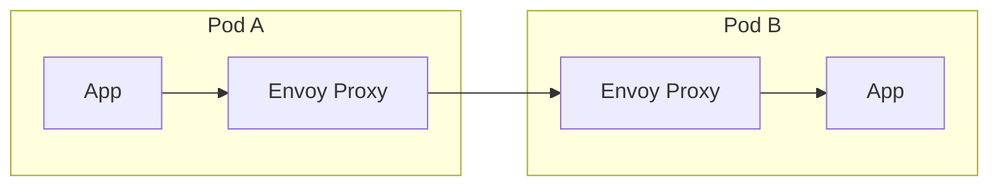

### 19. Ambassador Pattern
Centralizing connectivity logic to external services.

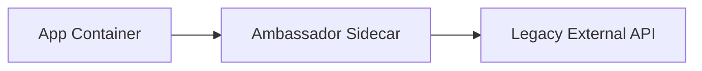

### 20. Init Container Workflow
Pre-deployment configuration and preparation.

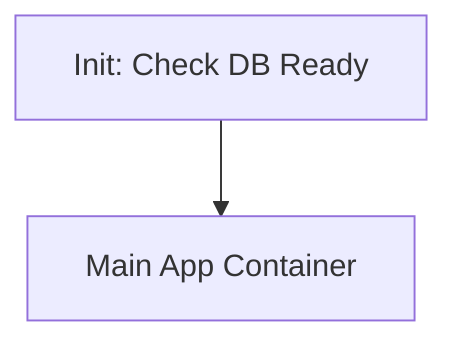

### 21. Service Mesh Traffic Flow
Advanced mTLS and traffic management.

```mermaid
graph LR
    Istio[Istio Control Plane] --> Envoy[Envoy Sidecars]
    Envoy -->|mTLS| Envoy
```

### 22. Blue/Green Deployment Model
Zero-downtime releases with instant rollback.

```mermaid
graph TD
    LB[Load Balancer] --> Green[Production (v1)]
    LB -.-> Blue[Staging (v2)]
    LB --> Blue[Production (v2)]
```

### 23. Canary Release Workflow
Gradual traffic shifting for risk reduction.

```mermaid
graph LR
    Traffic[Global Traffic] -->|95%| Stable[Stable Version]
    Traffic -->|5%| Canary[Canary Version]
```

### 24. HPA Autoscaling Flow
Scaling pods based on resource utilization.

```mermaid
graph TD
    Metrics[CPU / RAM Usage] --> HPA[Horizontal Pod Autoscaler]
    HPA --> ReplicaSet[Adjust Replica Count]
```

### 25. KEDA Event Scaling Model
Scaling containers based on external events.

```mermaid
graph LR
    Broker[Azure Service Bus] --> KEDA[KEDA Scaler]
    KEDA --> Deployment[Scale to 100 Pods]
```

### 26. Multi-container Pod Design
Tight coupling for specialized workloads.

```mermaid
graph TD
    subgraph "Pod"
        Main[Web Server]
        Helper[Cache Refresher]
    end
    Main --> Localhost[Localhost:6379]
```

### 27. Persistent Volume Pattern
Managing state in a containerized world.

```mermaid
graph LR
    Pod[Stateful Pod] --> Claim[PVC]
    Claim --> Volume[Azure Disk / EBS]
```

### 28. Secret Injection Workflow
Injecting credentials without environment variables.

```mermaid
graph TD
    Vault[HashiCorp Vault] --> CSI[Secrets Store CSI Driver]
    CSI --> Mount[Memory-backed File]
    Mount --> App[App Container]
```

### 29. ConfigMap Lifecycle
Updating configuration without restarts.

```mermaid
graph LR
    K8S_API[K8s API] --> Config[ConfigMap]
    Config --> Volume[Mounted File]
    Volume -->|Hot Reload| App[App]
```

### 30. Circuit Breaker Model
Preventing cascading failures in distributed systems.

```mermaid
graph LR
    API[Client API] --> CB[Circuit Breaker]
    CB -->|Failures > Threshold| Open[Open: Return Error]
```

### 31. Zero Trust Boundary Model
Securing container communication at every layer.

```mermaid
graph TD
    Policy[Network Policy] --> Deny[Default Deny]
    Deny --> Allow[Explicit Allow]
```

### 32. OIDC / SSO Auth Flow
Securing the container platform UI.

```mermaid
sequenceDiagram
    User->>Pattern_Hub: Login
    Pattern_Hub->>Azure_AD: Auth
    Azure_AD-->>User: Token
```

### 33. RBAC Model
Granular namespace permissions.

```mermaid
graph TD
    Role[Namespace Role] --> Binding[Role Binding]
    Binding --> User[Service Account]
```

### 34. Secrets Management Flow
The lifecycle of a container secret.

```mermaid
graph LR
    Secret[Database Password] --> Sealed[Sealed Secret (GitSafe)]
    Sealed --> Controller[Operator]
    Controller --> K8S[Kubernetes Secret]
```

### 35. Network Policy Model
East-West traffic segmentation.

```mermaid
graph LR
    Web[Web Namespace] --X Database[DB Namespace]
    Web --> API[API Namespace]
```

### 36. Metrics Pipeline
Monitoring container health.

```mermaid
graph LR
    Pod[Pod] --> Scrape[Prometheus]
    Scrape --> Alert[Alertmanager]
```

### 37. Logging Architecture
Centralized observability.

```mermaid
graph TD
    Container[App] --> Stdout[Stdout]
    Stdout --> DaemonSet[Fluentd Daemon]
```

### 38. Tracing Model
Distributed request tracing.

```mermaid
sequenceDiagram
    ServiceA->>ServiceB: TraceID: 123
    ServiceB->>ServiceC: TraceID: 123
```

### 39. SLA Monitoring Flow
Uptime verification for critical patterns.

```mermaid
graph LR
    Probe[Synthetic Probe] --> Status[Status Page]
```

### 40. Release Pipeline Workflow
Automated GitOps delivery.

```mermaid
graph LR
    Git[Code Change] --> Build[CI Build]
    Build --> ArgoCD[GitOps Sync]
```

### 41. Developer Self-Service Flow
Empowering teams with pre-approved patterns.

```mermaid
graph LR
    Portal[Backstage / IDP] --> Provision[Deploy Pattern]
```

### 42. Golden Path Platform Model
Standardizing the developer experience.

```mermaid
graph TD
    Template[Golden Template] --> App[Production App]
```

### 43. Environment Promotion Lifecycle
Moving container patterns through stages.

```mermaid
graph LR
    Dev[Dev] --> QA[QA]
    QA --> Staging[Staging]
    Staging --> Prod[Production]
```

### 44. Cost Optimization Model
Rightsizing container resources.

```mermaid
graph TD
    Usage[Actual Usage] --> Recom[VPA / Recommendation]
    Recom --> Resize[Adjust Requests/Limits]
```

### 45. Platform Governance Workflow
Maintaining standards across the estate.

```mermaid
graph LR
    Scan[Policy Scan] --> Report[Compliance Dashboard]
```

---

## 🔬 Container Architecture Education

### 1. Patterns vs. Practices
A **pattern** is a reusable solution to a common problem (e.g., Sidecar for logging). A **practice** is a methodology for applying those solutions (e.g., GitOps for deployment). This platform focuses on the "What" and "How" of container design.

### 2. Kubernetes vs. Serverless Containers
| Feature | Kubernetes (AKS/EKS) | Serverless (ACA/Cloud Run) |
|---|---|---|
| **Control** | Full (Node, OS, Runtime) | Limited (Application Only) |
| **Complexity** | High | Low |
| **Scaling** | Fine-grained | Request-driven |
| **Cost** | Operational + Infrastructure | Per-request / Consumption |

---

## 🚦 Getting Started

### 1. Prerequisites
- **Docker Desktop** (v4.20+).
- **Terraform** (v1.5+).
- **kubectl** & **Helm**.

### 2. Local Setup
```bash
# Clone the repository
git clone https://github.com/Devopstrio/container-app-patterns.git
cd container-app-patterns

# Launch the pattern catalog
docker-compose up --build
```
Access the Architecture Explorer at `http://localhost:3000`.

---

## 🛡️ Security & Platform Standards
- **Distroless Images**: All sample services use minimal, distroless base images to reduce attack surface.
- **Read-Only Filesystems**: Containers are configured to run with `readOnlyRootFilesystem: true` by default.
- **Non-Root Execution**: Every pattern enforces `runAsNonRoot: true` in the SecurityContext.

---
<sub>&copy; 2026 Devopstrio &mdash; Engineering the Future of Cloud-Native Architecture.</sub>
